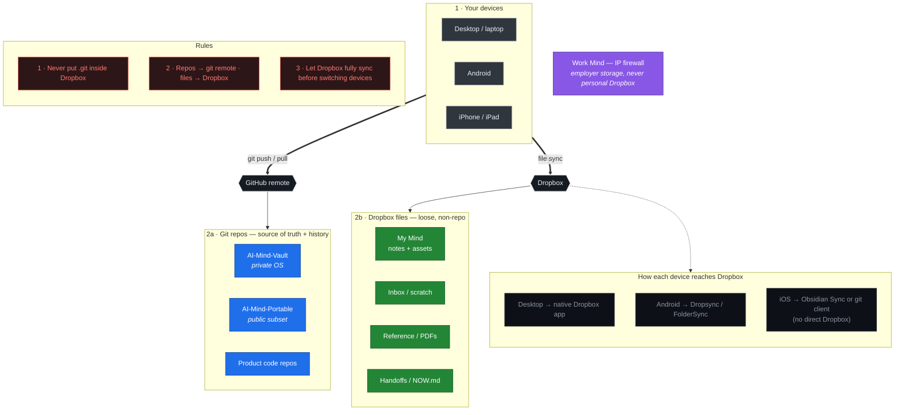
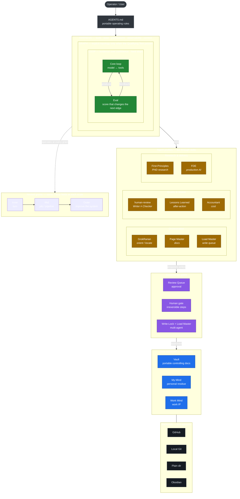

# AI Mind — Architecture & Data-Flow Charts

Working note (scratch). Two charts:

1. **Where and how data is stored and managed** — the git/Dropbox split across devices.
2. **Overall AI Mind OS architecture** — Harness · Loop · Graph over the three roots.

Both are Mermaid, so they render in GitHub and Obsidian and stay editable in plain text. Promote to `Concepts/` / `Process/` via `_meta/REVIEW_QUEUE.md` when ready.

---

## 1. Data storage & management

Two sync planes, one per data type. **Git repos** move through a git remote; **loose files** move through Dropbox. The two planes never mix (never nest a `.git` folder inside Dropbox).

**Continuity habits**

- Leaving a machine (code): `git add -A && git commit -m "wip" && git push`. Arriving: `git pull`.
- Leaving a machine (files): wait for Dropbox's full-sync checkmark before switching.
- `Handoffs/NOW.md`: current focus + next action, so mental context restores instantly.

---

## 2. Overall AI Mind OS architecture

Read it top-to-bottom as a spine: the **operator** sets rules, the **Harness** wraps a **Graph** that wraps the **Loop**, agent **profiles** act through skills, and writes reach the **data roots** only through **governance gates**.

**How to read it**

- **Harness ⊃ Graph ⊃ Loop** — the nested boxes are literal: the Loop lives inside a Graph (only when justified), which lives inside the Harness.
- **Evidence over confidence** — the Loop advances only on new evidence (Eval), with hard stops; it never loops on confidence.
- **Writer ≠ Checker** — `human-review` and independent checks grade output in a separate context.
- **Gates before writes** — permanent changes reach the roots only through the Review Queue / human gate / write-lock.
- **Portable vs private** — the public edition ships the architecture + generic profiles; domain skills and instance residue stay in the private OS and in My Mind / Work Mind.
