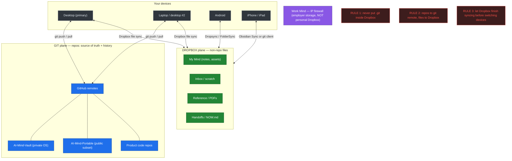
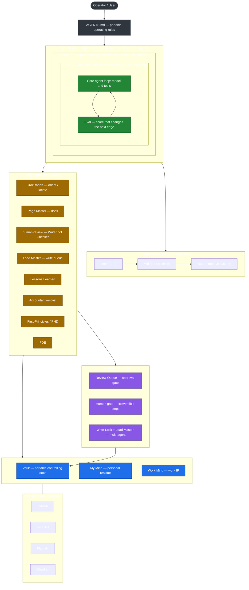

# AI Mind — Architecture & Data-Flow Charts

Working note (scratch). Two charts:

1. **Where and how data is stored and managed** — the git/Dropbox split across devices.
2. **Overall AI Mind OS architecture** — Harness · Loop · Graph over the three roots.

Both are Mermaid, so they render in GitHub and Obsidian and stay editable in plain text. Promote to `Concepts/` / `Process/` via `_meta/REVIEW_QUEUE.md` when ready.

---

## 1. Data storage & management

Rule of thumb: **git repos sync via a git remote; everything else syncs via Dropbox; never nest a `.git` folder inside Dropbox.**

**Continuity habits**

- Leaving a machine (code): `git add -A && git commit -m "wip" && git push`. Arriving: `git pull`.
- Leaving a machine (files): let Dropbox reach a full-sync checkmark first.
- `Handoffs/NOW.md`: current focus + next action, so mental context restores instantly.

---

## 2. Overall AI Mind OS architecture

The OS wraps the model in a **Harness**, runs an evidence-based **Loop**, and only adds an explicit **Graph** when the Qualifying Test passes. Agent profiles act through skills over three data roots, behind governance gates. The public portable edition is a subset (architecture + generic profiles); domain skills and residue live in the private OS.

**How to read it**

- **Harness ⊃ Graph ⊃ Loop** — the nested boxes are literal: the Loop lives inside a Graph (when justified), which lives inside the Harness.
- **Never loop on confidence** — the Loop advances only on new evidence (Eval), with hard stops.
- **Writer ≠ Checker** — `human-review` and independent checks grade output in a separate context.
- **Three roots** — Vault is shared/portable; My Mind and Work Mind hold instance residue (see chart 1 for how each syncs).
