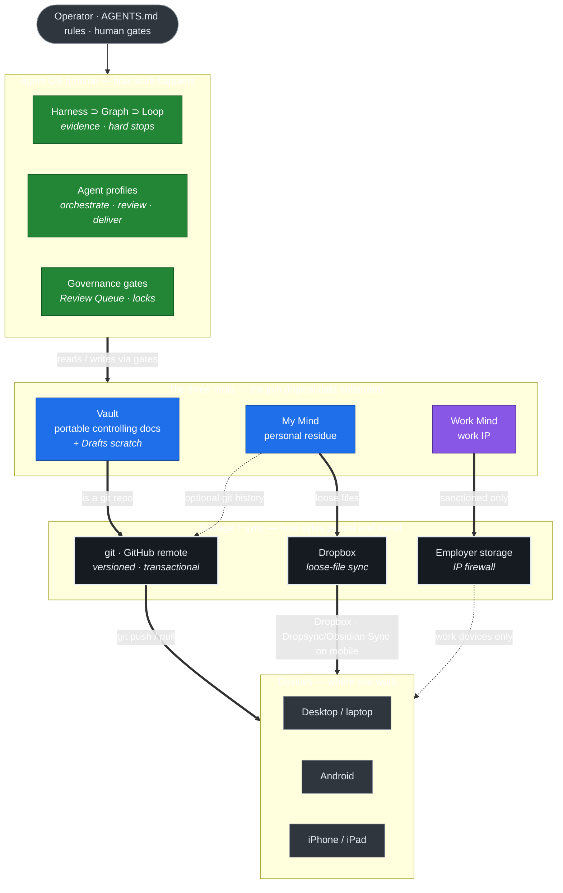
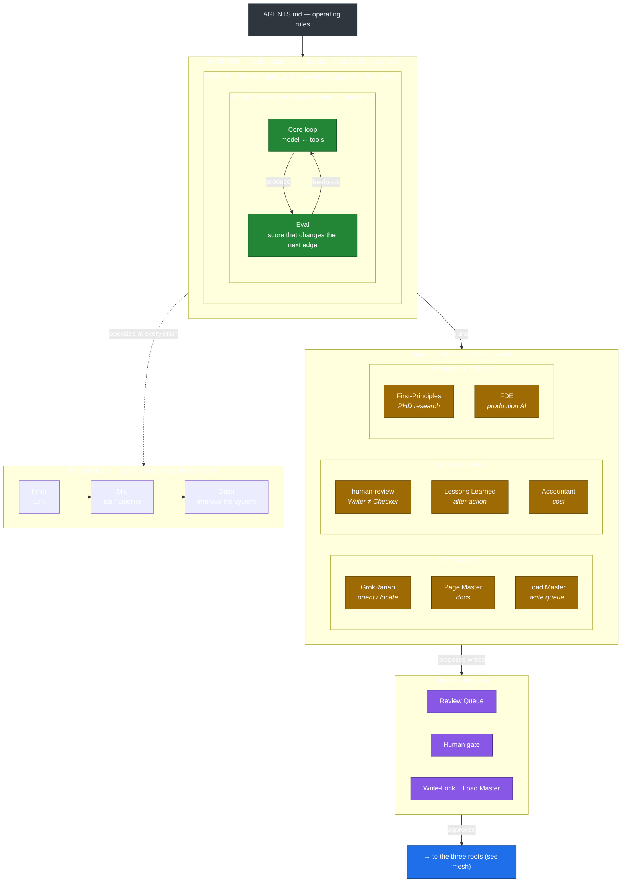
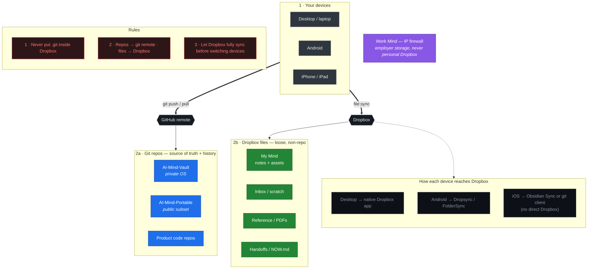

# AI Mind — Meshed Agent OS & File Management

The Agent OS and the file-management system are one system, joined at **the three roots**. The runtime operates on the roots from above; each root binds to a specific storage/sync mechanism below; devices sync from those mechanisms. That vertical binding is the whole trick.

- **The system at a glance** — the mesh: runtime ⟷ roots ⟷ storage ⟷ devices.
- **Zoom A** — Agent OS runtime (how work happens).
- **Zoom B** — Storage, sync & continuity (how files move).

All Mermaid, so they render in GitHub and Obsidian and stay editable. Promote to `Concepts/` / `Process/` via `_meta/REVIEW_QUEUE.md` when ready.

---

## The system at a glance — the mesh

Read the middle band first: the **three roots** are the spine. Everything above is *how work happens*; everything below is *how bytes persist and travel*. Each root maps to exactly one sync mechanism, which is why the system stays effective (no ambiguity) and efficient (right tool per data type).

**Why this meshes well**

- **One root ↔ one sync mechanism.** Vault is a git repo → git remote; My Mind is loose files → Dropbox; Work Mind is IP → employer storage. No file ever has two conflicting sync owners (which is what corrupts `.git` in Dropbox).
- **The OS never touches storage directly.** It reads/writes *roots*; the storage layer is swappable underneath (git, Dropbox, plain dir, Obsidian) without changing how agents work.
- **Governance sits at the join.** Permanent writes to a root pass a gate; the storage layer just carries what the gate approved.

---

## Zoom A — Agent OS runtime (how work happens)

---

## Zoom B — Storage, sync & continuity (how files move)

**Continuity habits**

- Leaving a machine (code): `git add -A && git commit -m "wip" && git push`. Arriving: `git pull`.
- Leaving a machine (files): wait for Dropbox's full-sync checkmark before switching.
- `Handoffs/NOW.md`: current focus + next action, so mental context restores instantly.
